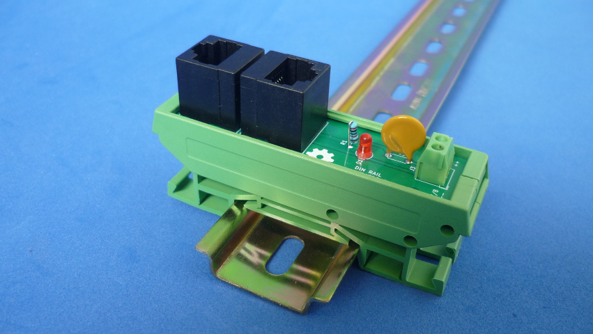

# DIN RAIL PASSIVE POE INJECTOR SLIM

Collection of DIN RAIL mountable circuits!

Read this in other languages: [Español](docs/README.es.md)
## How to use this repository

The projects were developed in KiCad V5.1

## License

This is an Open Hardware project an is licensed under a [Creative Commons Attribution 4.0 International License](https://creativecommons.org/licenses/by/4.0/)
