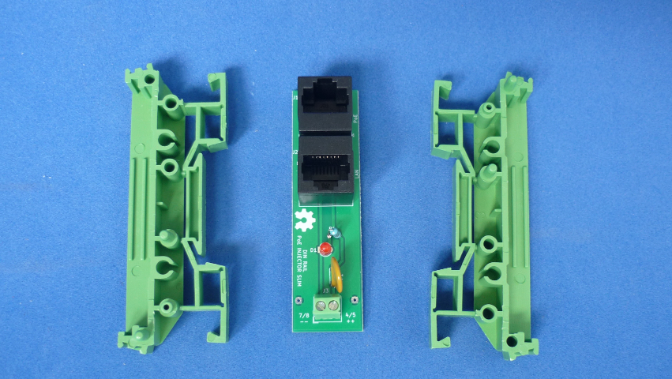

# INYECTOR PASIVO POE DELGADO PARA RIEL DIN 

Inyector PoE pasivo montable en riel din. Delgado 20 x 72 mm aprox. Hasta 48V, led indicador, proteccion por fusible rearmable 1.1 A 72V.

Lea esto en otros idiomas: [English](../README.md)
## Como usar este repositorio

El proyecto esta desarrollado en KiCad V5.1

## Estructura de directorios

* El directorio raiz contiene los archivos de KiCad: proyecto, esquematico y PCB.
* El directorio gerber/single contiene de fabricacion para una sola tarjeta.
* El directorio gerber/panel contiene archivos de fabricacion para multiples tarjetas panelizadas en un espacio maximo de 100mm x 100mm (usa Vcuts!).
* El directorio docs contiene archivos adicionales

## Licencia

Este es un proyecto de Hardware Libre y esta licenciado bajo una licencia [Creative Commons Attribution 4.0 International License](https://creativecommons.org/licenses/by/4.0/)
