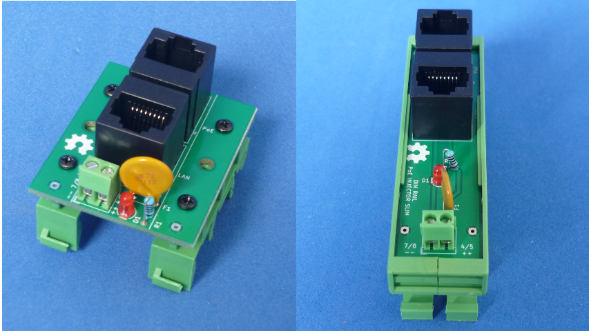

# CIRCUITOS PARA RIEL DIN 

Coleccion de circuitos montables en RIEL DIN!

Lea esto en otros idiomas: [English](../README.md)
## Como usar este repositorio

Los proyectos fueron desarrollados en KiCad V5.1

## Licencia

This is an Open Hardware project an is licensed under a [Creative Commons Attribution 4.0 International License](https://creativecommons.org/licenses/by/4.0/)
